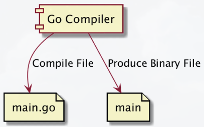
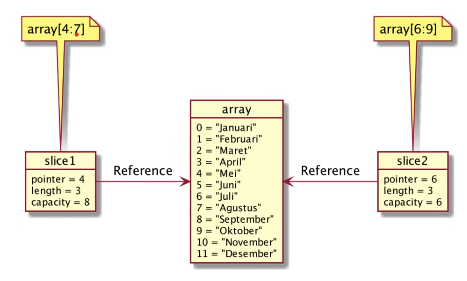

# Dasar GoLang

## Pengenalan

### Sejarah Go-Lang

- Dibuat di Google menggunakan bahasa pemrograman C.
- Di Rilis ke public sebagai open source pada tahun 2009.
- Go-Lang populer sejak digunakan untuk membuat Docker pada tahun 2011.
- Saat ini mulai banyak teknologi baru yang dibuat menggunakan bahasa Go-Lang dibandingkan bahasa C, seperti Kubernetes, Prometheus, CockroarchDB, dan lain-lain.
- Saat ini mulai populer untuk pembuatan Backend API di Microservices.

### Kenapa Belajar Go-Lang

- Bahasa Go-Lang sangat sederhana, tidak butuh waktu lama untuk mempelajarinya.
- Go-Lang mendukung baik concurrency programming, dimana saat ini kita hidup di zaman multicore processor.
- Go-Lang mendukung garbage collector, sehingga tidak butuh melakukan management memory secara manual seperti di bahasa C.
- Salah satu bahasa pemrograman yang sedang naik daun.

### Software Development Kit

- [Golang](https://golang.org/)
- Download Compiler Go-Lang.
- Install Compiler Go-Lang.
- Cek menggunakan perintah :

```sh
go version
```

### Proses Development Program Go-Lang



## Text Editor atau IDE

- Visual Studio Code.
- JetBrains GoLand.

## Program Hello World

```go
package main

import "fmt"

func main() {
  fmt.Println("Hello World")
}
```

## Tipe Data Number

- Ada dua jenis tipe data Number, yaitu :
  - Integer.
  - Floating Point.

| Tipe Data |    Nilai Minimum     |    Nilai Maksimum    |
| :-------: | :------------------: | :------------------: |
|   int8    |         -128         |         127          |
|   int16   |        -32768        |        32767         |
|   int32   |     -21474883648     |     21474883647      |
|   int64   | -9223372036843775808 | 9223372036843775807  |
|   uint8   |          0           |         255          |
|  uint16   |          0           |        65535         |
|  uint32   |          0           |      4294967295      |
|  uint64   |          0           | 18446744073709551615 |

### Tipe Data Floating Point

| Tipe Data  |                     Nilai Minimum                      | Nilai Maksimum |
| :--------: | :----------------------------------------------------: | :------------: |
|  float32   |                        -3.4e+38                        |    3.4e+38     |
|  float64   |                       -1.7e+308                        |   +1.7e+308    |
| complex64  | complex numbers with float32 real and imaginary parts. |       -        |
| complex128 | complex numbers with float64 real and imaginary parts. |       -        |

### Alias

| Tipe Data |     Alias      |
| :-------: | :------------: |
|   byte    |     uint8      |
|   rune    |     int32      |
|    int    | Minimal int32  |
|   uint    | Minimal uint32 |

### Kode : Tipe Data Number

```go
package main

import "fmt"

func main() {
  fmt.Println("Satu = ", 1)
  fmt.Println("Dua = ", 2)
  fmt.Println("Tiga Koma Lima = ", 3.5)
}
```

## Tipe Data Boolean

- Tipe data boolean adalah tipe data yang memiliki dua nilai, yaitu benar atau salah.
- Di Go-Lang, tipe data boolean direpresentasikan menggunakan kata kunci `bool`.

### Kode : Tipe Data Boolean

```go
package main

import "fmt"

func main() {
  fmt.Println("Benar = ", true)
  fmt.Println("Salah = ", false)
}
```

## Tipe Data String

- String ada tipe data kumpulan karakter.
- Jumlah karakter di dalam String bisa nol sampai tidak terhingga.
- Tipe data String di Go-Lang direpresentasikan dengan kata kunci `string`.
- Nilai data String di Go-Lang selalu diawali dengan karakter `"` (petik dua) dan diakhiri dengan karakter `"` (petik dua).

### Kode : Tipe Data String

```go
package main

import "fmt"

func main() {
  fmt.Println("Yusril")
  fmt.Println("Yusril Arzaqi")
  fmt.Println("Yusril Arzaqi memetik bunga")
}
```

### Fucntion untuk String

| Function           | Keterangan                                     |
| ------------------ | ---------------------------------------------- |
| `len("string)`     | Menghitung jumlah karakter di String           |
| `"string"[number]` | Mengambil karakter pada posisi yang ditentukan |

### Kode : Function untuk String

```go
package main

import "fmt"

func main() {
  fmt.Println("Yusril")
  fmt.Println("Yusril Arzaqi")
  fmt.Println("Yusril Arzaqi memetik bunga")
  fmt.Println(len("Yusril Arzaqi memetik bunga"))
  fmt.Println("Yusril Arzaqi memetik bunga"[10])
}
```

## Variable

- Variable adalah tempat untuk menyimpan data.
- Variable digunakan agar kita bisa mengakses data yang sama dimanapun kita mau.
- Di Go-Lang Variable hanya bisa menyimpan tipe data yang sama, jika kita ingin menyimpan yang berbeda-beda jenis, kita harus membuat beberapa variable.
- Untuk membuat variable, kita bisa menggunakan kata kunci `var`, lalu diikuti dengan nama variable dan tipe datanya.

### Kode : Variable

```go
func main() {
  var name string;

  name = "Yusril Arzaqi"
  fmt.Println(name)

  name = "Bimo Alamsyah"
  fmt.Println(name)
}
```

### Tipe Data Variable

- Saat kita membuat variable, maka kita wajib menyabutkan tipe data variable tersebut.
- Namun jika kita langsung menginisialisasikan data pada variable nya, maka tidak wajib menyebutkan tipe data variablenya.

```go
var friendName = "Adam Saptura";
fmt.Println(friendName)

var age int8 = 18;
fmt.Println(age)
```

### Kata Kunci Var

- Di Go-Lang kata kunci `var` saat membuat variable tidak lah wajib.
- Asalkan saat membuat variable kita langsung menginisialisasi datanya.
- Agar tidak perlu menggunakan kata kunci `var`, kita perlu menggunakan kata kunci `:=` saat menginisialisasikan data pada variable tersebut.

### kode : Kata Kunci Var

```go
author := "Dimas Rafif Fathony"
fmt.Println(author)
```

### Deklarasi Multiple Variable

- Di Go-Lang kita bisa membuat variable secara sekaligus banyak.
- Code yang dibuat sakan lebih bagus dan mudah dibaca.

```go
func main() {
  var (
    firstName = "Yusril"
    lastName =  "Arzaqi"
  )

  fmt.Println(firstName)
  fmt.Println(lastName)
}
```

## Constant

- Constant adalah variable yang nilainya tidak bisa diubah lagi setelah pertama kali diberi nilai.
- Cara pembuatan constant mirip dengan variable, yang membedakan hanya kata kunci yang digunakan adalah `const`, bukan `var`.
- Saat pembuatan constant, kita wajib langsung menginisialisasikan datanya.

### Kode : Constant

```go
func main() {
  const firstName string = "Yusril"
  const lastName = "Arzaqi"
  const value = 1000

  fmt.Println(firstName)
  fmt.Println(lastName)
  fmt.Println(value)

  /* ERROR
   * firstName = "tidak bisa diubah"
   * lastName = "tidak bisa diubah"
   */
}
```

### Deklarasi Multiple Constant

- Sama seperti Variabel, di Go-Lang juga kita bisa membuat constant secara sekaligus banyak.

```go
const (
  firstName = "Yusril"
  lastName         = "Arzaqi"
  value            = 1000
)
```

## Konversi Tipe Data

- Di Go-Lang kadang kita butuh melakukan konversi tipe data dari satu tipe ke tipe lain.
- Misal kita ingin mengkonversi tipe data `int32` ke `int64`, dan lain-lain.

```go
func main() {
	var nilai32 int32 = 32768
	var nilai64 int64 = int64(nilai32)

	var nilai16 int16 = int16(nilai32)
	var nilai8 int8 = int8(nilai32)

	fmt.Println(nilai32)
	fmt.Println(nilai64)
	fmt.Println(nilai16)
  fmt.Println(nilai8)

  var name = "Yusril arzaqi"
  var e byte = name[0]
  var eString = string(e)

  fmt.Println(name)
  fmt.Println(eString)
}
```

## Type Declaration

- Type Declaration adalah kemampuan membuat ulang tipe data dari tipe data yang sudah ada.
- Type Declaration biasanya digunakan untuk membuat alias terhadap tipe data yang sudah ada, dengan tujuan agar lebih mudah dimengerti.

```go
func main() {
  type NoKTP string
  type Married bool

  var ktpYus NoKTP = "101001931013"
  var marriedStatus Married = true
  fmt.Println(ktpYus)
  fmt.Println(marriedStatus)
  fmt.Println(NoKTP("22121313131"))
}
```

## Operasi Matematika

| Operator |   Keterangan    |
| :------: | :-------------: |
|    +     |   Penjumlahan   |
|    -     |   Pengurangan   |
|    \*    |    Perkalian    |
|    /     |   Pembagaian    |
|    %     | Sisa Pembagaian |

### Kode : Operasi Matematika

```go
func main() {
  var a = 10
  var b = 10
  var result = a + b

  fmt.Println(result) // 20
}
```

### Augmented Assignments

| Operasi Matematika | Augmented Assignments |
| :----------------: | :-------------------: |
|    `a = a + 10`    |       `a += 10`       |
|    `a = a - 10`    |       `a -= 10`       |
|    `a = a * 10`    |       `a *= 10`       |
|    `a = a / 10`    |       `a /= 10`       |
|    `a = a % 10`    |       `a %= 10`       |

```go
func main() {
  var i = 10;
  i += 10
  fmt.Println(i)
}
```

### Unary Operator

| Operator |    Keterangan     |
| :------: | :---------------: |
|   `++`   |    `a = a + 1`    |
|   `--`   |    `a = a - 1`    |
|   `-`    |     Negative      |
|   `+`    |     Positive      |
|   `!`    | Boolean Kebalikan |

### Kode : Unary Operator

```go
i++ // i = i + 1
fmt.Println(i) // 21

var positive = +1000
var negative = -1000
fmt.Println(positive)
fmt.Println(negative)
```

## Operasi Perbandingan

- Operasi perbandingan adalah operasi untuk membandingkan dua buah data.
- Operasi perbandingan adalah operasi yang menghasilkan nilai boolean (benar atau salah).
- Jika hasil operasinya adalah benar, maka nilainya adalah `true`.
- Jika hasil operasinya adalah salah, maka nilainya adalah `false`.

| Operator |       Keterangan        |
| :------: | :---------------------: |
|   `>`    |       Lebih Dari        |
|   `<`    |       Kurang Dari       |
|   `>=`   | Lebih Dari Sama Dengan  |
|   `<=`   | Kurang Dari Sama Dengan |
|   `==`   |       Sama Dengan       |
|   `!=`   |    Tidak Sama Dengan    |

## Kode : Operasi Perbandingan

```go
func main() {
  var name1 = "Yusril";
  var name2 = "Arzaqi";

  var result bool = name1 == name2; // false
  fmt.Println(result)
  result = name1 != name2; // true
  fmt.Println(result)

  var num1 = 100
  var num2 = 200
  fmt.Println(num1 > num2) // false
  fmt.Println(num1 < num2) // true
  fmt.Println(num1 >= num2) // false
  fmt.Println(num1 <= num2) // true
  fmt.Println(num1 == num2) // false
  fmt.Println(num1 != num2) // true
```

## Operasi Boolean

| Operator | Keterangan |
| :------: | :--------: |
|   `&&`   |    Dan     |
|  `\|\|`  |    Atau    |
|   `!`    | Kebalikan  |

### Operasi &&

| Nilai 1 | Operator | Nilai 2 | Hasil   |
| :-----: | :------: | :-----: | ------- |
| `true`  |   `&&`   | `true`  | `true`  |
| `true`  |   `&&`   | `false` | `false` |
| `false` |   `&&`   | `true`  | `false` |
| `false` |   `&&`   | `false` | `false` |

### Operator ||

| Nilai 1 | Operator | Nilai 2 | Hasil   |
| :-----: | :------: | :-----: | ------- |
| `true`  |  `\|\|`  | `true`  | `true`  |
| `true`  |  `\|\|`  | `false` | `true`  |
| `false` |  `\|\|`  | `true`  | `true`  |
| `false` |  `\|\|`  | `false` | `false` |

### Operator !

| Operator | Nilai 2 |  Hasil  |
| :------: | :-----: | :-----: |
|   `!`    | `true`  | `fasle` |
|   `!`    | `false` | `true`  |

### Kode : Operasi Boolean

```go
func main() {
  var nilaiAkhir = 90;
  var absensi = 80;

  var lulusAbsensi bool = absensi > 80; // false
  var lulusNilaiAkhir bool = nilaiAkhir >= 80; // true
  var lulusAbsensi bool = absensi >= 80; // true

  var lulus bool = lulusAbsensi && lulusNilaiAkhir; // true

  fmt.Println(lulus)
  fmt.Println(nilaiAkhir >= 80 && absensi >= 80) // true
}
```

## Tipe Data Array

- Array adalah tipe data yang berisikan kumpulan data dengan tipe yang sama.
- Saat membuat array, kita perlu menentukan jumlah data yang bisa ditampung oleh Array tersebut.
- Daya tampung Array tidak bisa bertambah setelah Array dibuat.

### Index di Array

| Index |  Data  |
| :---: | :----: |
|   0   | Yusril |
|   1   | Arzaqi |

### Kode : Tipe Data Array

```go
func main() {
	var names [2]string
	names[0] = "Yusril"
	names[1] = "Arzaqi"

	fmt.Println(names[0]) // yusril
	fmt.Println(names[1]) // arzaqi
}
```

### Membuat Array Langsung

- Di Go-Lang kita juga bisa membuat Array secara langsung saat deklarasi variable.

```go
var values = [3]int{
  95,
  90,
  80,
};
fmt.Println(values) //  [95, 90, 80]
```

### Function Array

|        Operasi         |           Keterangan            |
| :--------------------: | :-----------------------------: |
|      `len(array)`      | Untuk mendapatkan panjang Array |
|     `array[index]`     |  Mendapat data di posisi index  |
| `array[index] = value` |  Mengubah data di posisi index  |

```go
fmt.Println(len(names))
fmt.Println(len(values))

var test [9]int
fmt.Println(len(test)) // 10
```

## Tipe Data Slice

- Tipe data Slice adalah potongan dari data Array.
- Slice mirip dengan Array, yang membedakan adalah ukuran Slice bisa berubah.
- Slice dan Array selalu terkoneksi, dimana Slice adalah data yang mengakses sebagaian atau seluruh data di Array.
- Tipe Data Slice memiliki 3 data, yaitu pointer, length dan capacity.
- Pointer adalah penunjuk data pertama di array pada slice.
- Length adalah panjang dari slice, dan
- Capacity adalah kapasitas dari slice, dimana length tidak boleh lebih dari capacity.

### Detail Tipe Data Slice

- Tipe Data Slice memiliki 3 data, yaitu pointer, length dan capacity.
- Pointer adalah penunjuk data pertama di array para slice.
- Length adalah penunjuk data pertama di array para slice.
- Capacity adalah kapasitas dari slice, dimana length tidak boleh lebih dari capacity.

### Membuat Slice Dari Array

|   Membuat Slice   |                               Keterangan                               |
| :---------------: | :--------------------------------------------------------------------: |
| `array[low:high]` |  Membuat slice dari array dimulai index low sampai index sebelum high  |
|   `array[low:]`   | Membuat slice dari array dimulai index low sampai index akhir di array |
|  `array[:high]`   |   Membuat slice dari array dimulai index 0 sampai index sebelum high   |
|    `array[:]`     | Membuat slice dari array dimulai index 0 sampai index akhir dari array |

### Slice dan Array



### Kode : Tipe Data Slice

```go
func main() {
  names := [...]string{
    "Yusril Arzaqi",
    "Bimo Alamsyah",
    "Adam Saptura",
    "Dimas Rafif",
    "Irfan",
  }
  slice := names[1:4]

  fmt.Println(slice[0]) // Bimo Alamsyah
  fmt.Println(slice[1]) // Adam Saptura
  fmt.Println(len(names)) // 5
}
```

### Function Slice

|               Operasi                |                                    Keterangan                                    |
| :----------------------------------: | :------------------------------------------------------------------------------: |
|             `len(slice)`             |                         Untuk mendapatkan panjang slice                          |
|             `cap(slice)`             |                           Untuk mendapatkan kapasitas                            |
|        `append(slice, data)`         | Memubat slice baru dengan nemambah data ke posisi terakhir slice, jika kapasitas |
| `make([]TypeData, length, capacity)` |                                Membuat slice baru                                |
|     `copy(destination, source)`      |                    Menyalin slice dari source ke destination                     |

### Kode : Append Slice

```go
  daySlice2 := append(daySlice1, "Libur Baru") // membuat dan menambah slice baru dari daySlice1
  daySlice2[0] = "Ups" // mengganti Sabtu Baru menjadi "Ubs"
  fmt.Println(daySlice2) // [Ups Minggu Baru Libur Baru]
  fmt.Println(days) // [Senin Selasa Rabu Kamis Jumad Sabtu Baru Minggu Baru]

```

### Kode : Make Slice

```go
newSlice := make([]string, 2, 5)
newSlice[0] = "Yusril"
newSlice[1] = "Arzaqi"

fmt.Println(newSlice)
fmt.Println(len(newSlice))
fmt.Println(cap(newSlice))
```

### Kode : Copy Slice

```go
fromSlice := days[:]
toSlice := make([]string, len(fromSlice), cap(fromSlice))
copy(toSlice, fromSlice)

fmt.Println(toSlice)
```

### Hati - Hati Saat Membuat Array

- Saat membuat Array, kita harus berhati-hati, jika salah, maka yang kita buat bukanlah array, melainkan slice.

```go
iniArray := [5]int{1, 2, 3, 4, 5}
iniSlice := []int{1,2,3 ,4, 5 }

fmt.Println(iniArray)
fmt.Println(iniSlice)
```

## Tipe Data Map

- Pada Array atau Slice, untuk mengakses data, kita menggunakan index Number dimulai dari 0.
- Map adalah tipe data lain yang berisikan kumpulan data yang sama, namun kita bisa menentukan jenis tipe data index yang akan kita gunakan.
- Sederhananya, Map adalah tipe data dan kumpulan key-value (kata kunci - nilai), dimana kata kunci bersifat unik, tidak boleh sama.
- Berbeda dengan Array dan Slice, jumlah data yang kita masukan ke dalam Map boleh sebanyak-banyaknya, asalkan kata kuncinya berbeda, jika kita gunakan kata kunci sama, maka secara otomatis data sebelumnya akan diganti dengan data baru.

### Kode : Tipe Data Map

```go
func main() {
  var person /* map[string]string */ = map[string]string {
    "firstName" : "Yusril",
    "lastName" : "Arzaqi",
    "address": "Semarang",
  };

  person["title"] = "Mahasiswa"

  fmt.Println(person) // map[address:Semarang firstName:Yusril lastName:Arzaqi title:Mahasiswa]
  fmt.Println(person["firstName"]) // Yusril
  fmt.Println(person["lastName"]) // Arzaqi
  fmt.Println(person["address"]) // Semarang
  fmt.Println(person["title"]) // Mahasiswa
}
```

### Function Map

|            Operasi            |              Keterangan              |
| :---------------------------: | :----------------------------------: |
|          `len(map)`           | Untuk mendapatkan jumlah data di map |
|          `map[key]`           |   Mengambil data di map dengan key   |
|      `map[key] = value`       |   Mengubah data di map dengan key    |
| `make(map[TypeKey]TypeValue)` |           Membuat map baru           |
|      `delete(map, key)`       |   Menghapus data di map dengan key   |

### Kode : Function Map

```go
func main() {
  book := make(map[string]string) // membuat map kosong
  book["title"] = "Buku Go-Lang"
  book["author"] = "Yusril Arzaqi"
  book["wrong"] = "Ups"

  delete(book, "wrong") // menghapus key "wrong"

  fmt.Println(book)
}
```

## If Expression

- If adalah salah satu kata kunci yang digunakan untuk percabangan.
- Percabangan artinya kita bisa mengeksekusi kode program tertentu ketika suatu kondisi terpenuhi.
- Hampir di semua bahasa pemrograman mendukung if expression.

### Kode : if Expression

```go
func main() {
    name := "Yusril"

    if name == "Yusril" {
        fmt.Println("Hello Yusril")
    }
}
```

### Else Expression

- Blok `if` akan dieksekusi ketika kondisi `if` bernilai `true`.
- Kadang kita ingin melakukan eksekusi program tertentu jika kondisi `if` bernilai `false`.
- Hal ini bisa dilakukan menggunakan `else` expression.

### Kode : Else Expression

```go
func main() {
  name := "Yusril";

  if name == "Yusril" /* true */ {
    fmt.Println("Hello Yusril");
  } else {
    fmt.Println("Hai, ... ?")
  }
}
```

### Else If Expression

- Kadang dalam if, kita butuh membuat beberapa kondisi.
- Kasus seperti ini, kita bisa menggunakan `else if` expression.

### Kode : Else If Expression

```go
func main() {
  // name := "Yusril"; // true
  name := "Arzaqi"; // false

  if name == "Yusril" /* true */ {
    fmt.Println("Hello Yusril"); // print jika name "Yusril"
  } else if name == "Arzaqi" {
    fmt.Println("Hello Arzaqi") // print jika name "Arzaqi"
  } else {
    fmt.Println("Hai, ... ?"); // print jika name tidak "Yusril" atau "Arzaqi"
  }
}
```

### If dengan Shot Statement

- `if` mendukung shor statment sebelum kondisi.
- Hal ini sangat cocok untuk membuat statement yang sederhana sebelum melakukan pengecekan terhadap kondisi.

### Kode : if short statement

```go
func main() {
    if length := len(name); length > 5 {
        fmt.Println("Nama Terlalu panjang");
    } else {
        fmt.Println("Nama sudah benar")
    }
}
```

## Switch Expression

- Selain `if` expression, untuk melakukan percabangan, kita juga bisa menggunakan Switch Expression.
- Switch expression sangat sederhana dibandingkan `if`.
- Bisasanya `switch` expression digunakan untuk melakukan pengecekan ke kondisi dalam satu variable.

### Kode : Switch
