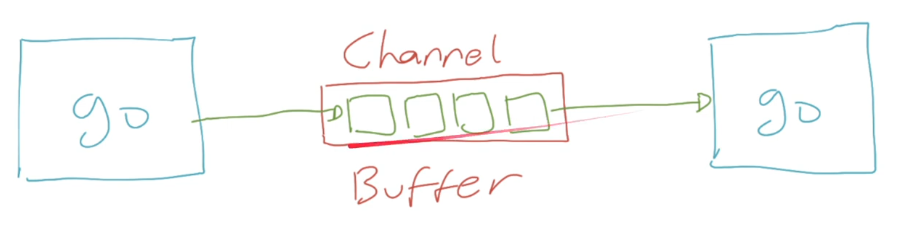

# Goroutines

## Sebelum Belajar

- Go-Lang Dasar.
- Go-Lang Modules.
- Go-Lang Unit Test.

## Agenda

- Concurrency & Parallel Programming.
- Goroutine.
- Membuat Project
- Channel.
- Buffered Channel.
- Mutex.
- WaitGroup.
- Atomic.
- Ticker.
- Dan lain-lain.

## Pengenalan Concurrency dan Parallel Programming

- Saat ini kita hidup di era multicore, dimana jarang sekali kita menggunakan prosesor yang single.
- Semakin canggih perangka keras, maka software pun akan mengikuti, dimana sekarang kita bisa dengan mudah membuat proses parallel di aplikasi.
- Parallel programming sederhananya adalah memecahkan suatu masalah dengan cara membaginya menjadi yang lebih kecil, dan dijalankan secara bersamaan pada waktu yang bersamaan pula.

### Contoh Parallel

- Menjalankan berbeda aplikasi sekaligus di sistem operasi kita (office, editor, browser, dan lain-lain).
- Beberapa koki menyiapkan memakan di restoran, dimana tiap koki membuat makanan masing-masing.
- Antrian di Bank, dimana tiap teller melayani nasabah nya masing-masing.

### Process vs Thread

|                    Process                    |                           Thread                           |
| :-------------------------------------------: | :--------------------------------------------------------: |
|    Process adalah sebuah eksekusi program     |             Thread adalah segmen dari process              |
|       Process mengkonsumsi memory besar       |              Thread menggunakan memory kecil               |
| Process saling terisolasi dengan process lain | Thread bisa saling berhubungan jika dalam prcess yang sama |
|   Process lama untuk dijalankan dihentikan    |        Tread cepat untuk dijalankan dan dihentikan         |

### Parallel vs Concurrency

- Berbeda dengan parallel (menjalankan beberapa pekerjaan secara bersamaan), concurrency adalah menjalankan beberapa pekerjaan secara bergantian.
- Dalam parallel kita bisanya membutuhkan banyak Thread, sedangkan dalam concurrency, kita hanya membutuhkan sedikit Thread.

### Diagram Parallel


### Diagram Concurrency


### Contoh Concurrency

- Saat kita makan di cafe, kita bisa makan, lalu ngobrol, lalu minum, makan lagi, ngobrol lagi, minum lagi, dan seterusnya.
- Tetapi kita tidak bisa pada saat yang bersamaan minum, makan dan ngobrol, hanya bisa melakukan saat hal pada satu waktu, namun bisa bergantian kapanpun kita mau.

### CPU-bound

- Banyak algoritma dibuat yang hanya membutuhkan CPU untuk menjalankannya, algoritma jenis ini biasanya sangat tergantung dengan kecepatan CPU.
- Contoh yang paling populer adalah _Machine Learning_, oleh karena itu sekarang banyak sekali teknologi _Machine Learning_ yang banyak menggunakan GPU karena memiliki core yang lebih banyak dibanding CPU biasanya.
- Jenis algoritma seperti ini tidak ada benefitnya menggunakan Concurrency Programming, namun bisa dibantu dengan implementasi Parallel Programming.

### I/O-bound

- I/O-bound adalah kebalikan dari sebelumnya, dimana biasanya algoritma atau aplikasinya sangat tergantung dengan kecepatan input output devices yang digunakan.
- Contohnya aplikasi seperti membaca data dari file, database, dan lain-lain.
- Kebanyakan saat ini, biasanya kita akan membuat aplikasi jenis seperti ini.
- Aplikasi jenis I/O-bound, walaupun bisa terbantu dengan implementasi Parallel Programming, tapi benefitnya akan lebih baik jadi menggunakan Concurrency Programming.
- Bayangkan kita membaca data dari database, dan Thread harus menunggu 1 detik untuk mendapat balasan dari database, padahal waktu 1 detik itu jika menggunakan Concurrency Programming, bisa digunakan untuk melakukan hal lain lagi.

## Pengenalan Goroutines

- Goroutines adalah sebuah thread ringan yang dikelola oleh Go Runtime.
- Ukuran Goroutine sangat kecil, sekitar 2kb, jauh lebih kecil dibandingkan Thread yang bisa sampai 1mb atau 1000kb.
- Namun tidak seperti thread yang berjalan parallel, goroutine berjalan secara concurrent.

### Cara Kerja Goroutine

- Sebenarnya, Goroutine dijalankan oleh Go Scheduler dalam thread, dimana jumlah thread nya sebanyak `GOMAXPROCS` (biasanya sejumlah core CPU).
- Jadi sebenarnya tidak bisa dibilang Goroutine itu pengganti Thread, karena Goroutine sendiri berjalan di atas Thread.
- Namun yang mempermudah kita adalah, kita tidak perlu melakukan manajemen Thread secara manual, semua sudah diatur oleh Go Scheduler.

### Cara Kerja Go Scheduler

Dalam Go-Scheduler, kita akan mengenal beberapa terminologi.

- **G** : Goroutine
- **M** : Thread (Machine)
- **P** : Processor


## Membuat Project

- Buat folder belajar-golang-goroutine.
- Buat module :
  - `go mod init belajar-golang-goroutine`

## Membuat Goroutine

- untuk membuat goroutine di Go-Lang sangat lah sederhana.
- Kita hanya cukup menambahkan perintah go sebelum memanggil function yang akan kita jalankan dalam goroutine.
- Saat sebuah function kita jalankan dalam goroutine, function tersebut akan berjalan secara asynchronous, artinya tidak akan ditunggu sampai function tersebut selesai.
- Aplikasi akan lanjut berjalan ke kode program selanjutnya tanpa menunggu goroutine yang kita buat selesai.

## Kode : Membuat Goroutine

```go
func SayHello(name string) {
  fmt.Println("Hello " + name)
}

func TestCreateGoroutine(t *testing.T) {
  go SayHello("Yusril")
  // SayHello("Yusril")
  fmt.Println("Ups")

  time.Sleep(1 * time.Second)
}
```

## Goroutine Sangat Ringan

- Seperti yang sebelumnya dijelaskan, bahwa goroutine itu sangat ringan.
- Kita bisa membuat ribuan, bahkan sampai jutaan goroutine tanpa takus boros memory.
- Tidak seperti thread yang ukurannya berat, goroutine sangatlah ringan.

### Kode : Membuat Banyak Goroutine

```go
func DisplayNumber(number int) {
  fmt.Println("Display", number)
}

func TestManyGoroutine(t *testing.T) {
  for i := 0; i < 100000;i++ {
    go DisplayNumber(i)
  }

  time.Sleep(1 * time.Second)
}
```

## Pengenalan Channel

- Channel adalah tempat komunikasi secara synchrounous yang bisa dilakukan oleh goroutine.
- Di Channel terdapat pengirim dan penerima, biasanya pengirim adlah goroutine yang berbeda.
- Saat melakukan pengirim data ke Channel, goroutine akan ter-block, sampai ada yang menerima data tersebut.
- Maka dari itu, channel disebut alat komunikasi synchrounous (blocking).
- Channel cocok sekali sebagai alternatif seperti mekanisme `async` `await` yang terdapat di beberapa bahasa programming lain.

### Diagram Channel


### Karakteristik Channel

- Secara default channel hanya bisa menampung satu data, jika kita ingin menambahkan data lagi, harus menunggu data yang ada di channel diambil.
- Channel hanya bisa menerima satu jenis data.
- Channel bisa diambil dari lebih dari satu goroutine.
- Channel harus di close jika tidak digunakan, atau bisa menyebabkan memory leak.

## Membuat Channel

- Channel di Go-Lang direpresentasikan dengan tipe data chan.
- Untuk membuat channel mudah, kita bisa menggunakan `make()`, mirip ketika membuat map.
- Namun saat pembuatan channel, kita harus tentukan tipe data apa yang bisa dimasukan kedalam channel tersebut.

### Kode : Membuat Channel

```go
channel := make(chan string)
```

### Mengirim dan Menerima Data dari Channel

- Seperti yang sudah dibahas sebelumnya, channel bisa digunakan untuk mengirim dan menerima data.
- Untuk mengirim data, kita bisa gunakan kode :
  - `channel <- data`.
- Sedangkan untuk menerima data, bisa gunakan kode :
  - `data <- channel`.
- Jika selesai, jangan lupa untuk menutup menggunakan function `close()`.

### Kode : Membuat Channel (2)

```go
func TestCreateChannel(t *testing.T) {
  channel := make(chan string)
  defer close(channel)

  go func() {
    time.Sleep(1 * time.Second)
    channel <- "Yusril Arzaqi"
    fmt.Println("Selesai Mengirim Data ke Channel")
  }()

  time.Sleep(5 * time.Second)
}
```

### Channel Sebagai Parameter

- Dalam kenyataan pembuatan aplikasi, seringnya kita akan mengirim channel ke function lain via parameter.
- Sebelumnya kita tahu bahkan di Go-Lang by default, parameter adalah pass by value, artinya value akan diduplikasi lalu dikirim ke function parameter, sehingga jika kita ingin mengirim data asli, kita bisa gunakan pointer (agar pass by refernce).
- Berbeda dengan Channel, kita tidak perlu melakukan hal tersebut.

### Kode : Channel Sebagai Parameter

```go
func GiveMeResponse(channel chan string) {
  time.Sleep(2 * time.Second)
  channel <- "Yusril Arzaqi"
}

func TestChannelAsParameter(t *testing.T) {
  channel := make(chan string)

  go GiveMeResponse(channel)

  data := <- channel
  fmt.Println(data)
  close(channel)
}
```

## Channel In dan Out

- Saat kita mengirim channel sebagai parameter, isi function tersebut bisa mengirim dan menerima data dari channel tersebut.
- Kadang kita ingin memberi tahu tarhap function, misal bahwa channel tersebut hanya digunakan untuk mengirim data, atau hanya dapat digunakan untuk data.
- Hal ini bisa kita lakukan parameter dengan cara menandai apakah channel ini digunakan untuk _in_ (mengirim) atau _out_ (menerima data).

### Kode : Channel In dan Out

```go
func OnlyIn(channel chan<- string) {
  time.Sleep(1 * time.Second)
  channel <- "Yusril Arzaqi"
}

func OnlyOut(channel chan<- string) {
  // data := <- channel
  // sama saja
  fmt.Println(<- channel)
}

func TestInOutChannel(t *testing.T) {
  channel = make(chan string);
  defer close(channel)

  go OnlyIn(channel)
  go OnlyOut(channel)

  time.Sleep(2 * time.Second)
}
```

## Buffered Channel

- Seperti yang dijelaskan sebelumnya, bahwa secara default channel itu hanya bisa menerima 1 data.
- Artinya jika kita menambah data ke-2, maka kita akan meminta menunggu sampai data ke-1 ada yang mengambil.
- Kadang-kadang ada kasus dimana pengirim lebih cepa dibanding penerima, dalam hal ini jika kita menggunakan channel, maka otomatis pengirim akan ikut lambat juga.
- Untuknya ada Buffered Channel, yaitu buffer yang bisa digunakan untuk menampung data antrian di Channel.

### Buffer Capacity

- Kita bebas memasukkan beberapa jumlah kapasitas antrian di dalam buffer.
- Jika kita set misal 5, artinya kita bisa menerima 5 data dibuffer.
- Jika kita mengirim data ke 6, maka kita diminta untuk menenggu sampai buffer ada yang kosong.
- Ini cocok sekali ketika memang goroutine yang menerima data lebih lambat dari yang mengirim data.

### Diagram Channel Buffer



### Kode : Membuat Buffered Channel

```go
package main

import "fmt"

func main() {
	channel := make(chan string, 3)

	fmt.Println(cap(channel)) // melihat panjang buffer
	fmt.Println(len(channel)) // melihat jumlah data dibuffer
}
```

## Range Channel

- Kadang-kadang ada kasus sebuah channel dikirim data secara terus menerus oleh pengirim.
- Dan kadang tidak jelas kapan hannel tersebut akan berhenti menerima data.
- Salah satu yang kita lakukan adalah dengan menggunakan perulangan range ketika menerima data dari channel.
- Ketika sebuah channel di `close()`, maka secara otomatis perulangan tersbut akan berhenti.
- Ini lebih sederhana dari pada kita melakukan pengecekan channel secara manual.

### Kode : Range Channel

```go
func TestRangeChannel(t *testing.T) {
  channel := make(chan string)

  go func() {
    for i := 0; i < 10; i++ {
      channel <- "Perulangn " + strconv.Itoa(i)
    }
    close(channel)
  }()

  for data := range channel {
    fmt.Println(data)
  }

  fmt.Println("DONE")
}
```

## Select Channel

- Kadang ada kasus dimana kita membuat beberapa channel, dan menjalankan beberapa goroutine.
- Lalu kita ingin mendapatkan data dari semua channel tersbut.
- Untuk melakukan hal tersebut, kita bisa menggunakan select channel di Go-Lang.
- Dengan select channel, kita bisa memilih data tercepat dari beberapa channel, jika data datang secara bersamaan di beberapa channel, maka akan dipilih secara random.

### Kode : Select Multiple Channel

```go
func TestSelectChannel(t *testing.T) {
	channel1 := make(chan string)
	channel2 := make(chan string)
	counter := 0
  defer close(channel1)
  defer close(channel2)

  go GiveMeResponse(channel1)
  go GiveMeResponse(channel2)

	for {
		select {
		case data := <-channel1:
			fmt.Println("Data dari Channel 1", data)
			counter++
		case data := <-channel2:
			fmt.Println("Data dari Channel 2", data)
			counter++
		}
		if counter == 2 {
			break
		}
	}
}
```

###
