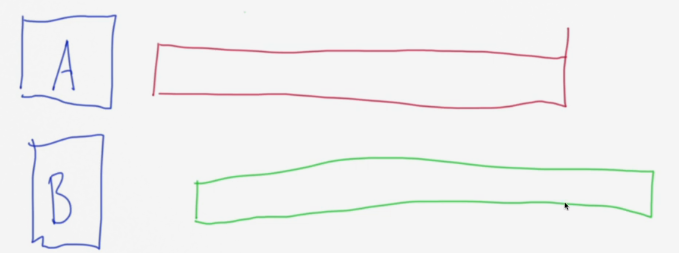
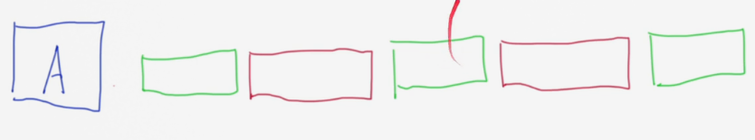
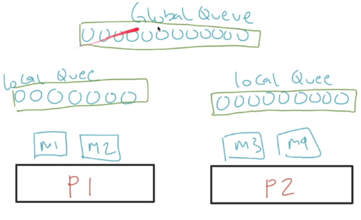
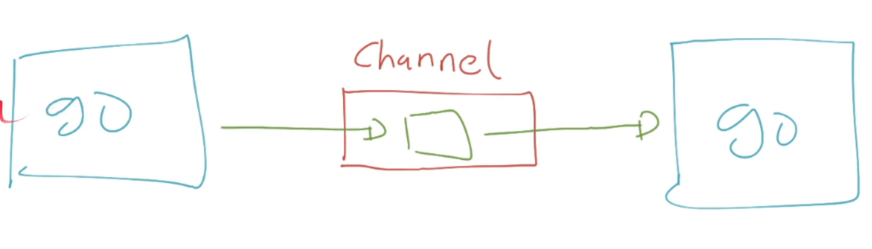

# Goroutines

## Sebelum Belajar

- Go-Lang Dasar.
- Go-Lang Modules.
- Go-Lang Unit Test.

## Agenda

- Concurrency & Parallel Programming.
- Goroutine.
- Membuat Project
- Channel.
- Buffered Channel.
- Mutex.
- WaitGroup.
- Atomic.
- Ticker.
- Dan lain-lain.

## Pengenalan Concurrency dan Parallel Programming

- Saat ini kita hidup di era multicore, dimana jarang sekali kita menggunakan prosesor yang single.
- Semakin canggih perangka keras, maka software pun akan mengikuti, dimana sekarang kita bisa dengan mudah membuat proses parallel di aplikasi.
- Parallel programming sederhananya adalah memecahkan suatu masalah dengan cara membaginya menjadi yang lebih kecil, dan dijalankan secara bersamaan pada waktu yang bersamaan pula.

### Contoh Parallel

- Menjalankan berbeda aplikasi sekaligus di sistem operasi kita (office, editor, browser, dan lain-lain).
- Beberapa koki menyiapkan memakan di restoran, dimana tiap koki membuat makanan masing-masing.
- Antrian di Bank, dimana tiap teller melayani nasabah nya masing-masing.

### Process vs Thread

|                    Process                    |                           Thread                           |
| :-------------------------------------------: | :--------------------------------------------------------: |
|    Process adalah sebuah eksekusi program     |             Thread adalah segmen dari process              |
|       Process mengkonsumsi memory besar       |              Thread menggunakan memory kecil               |
| Process saling terisolasi dengan process lain | Thread bisa saling berhubungan jika dalam prcess yang sama |
|   Process lama untuk dijalankan dihentikan    |        Tread cepat untuk dijalankan dan dihentikan         |

### Parallel vs Concurrency

- Berbeda dengan parallel (menjalankan beberapa pekerjaan secara bersamaan), concurrency adalah menjalankan beberapa pekerjaan secara bergantian.
- Dalam parallel kita bisanya membutuhkan banyak Thread, sedangkan dalam concurrency, kita hanya membutuhkan sedikit Thread.

### Diagram Parallel



### Diagram Concurrency



### Contoh Concurrency

- Saat kita makan di cafe, kita bisa makan, lalu ngobrol, lalu minum, makan lagi, ngobrol lagi, minum lagi, dan seterusnya.
- Tetapi kita tidak bisa pada saat yang bersamaan minum, makan dan ngobrol, hanya bisa melakukan saat hal pada satu waktu, namun bisa bergantian kapanpun kita mau.

### CPU-bound

- Banyak algoritma dibuat yang hanya membutuhkan CPU untuk menjalankannya, algoritma jenis ini biasanya sangat tergantung dengan kecepatan CPU.
- Contoh yang paling populer adalah _Machine Learning_, oleh karena itu sekarang banyak sekali teknologi _Machine Learning_ yang banyak menggunakan GPU karena memiliki core yang lebih banyak dibanding CPU biasanya.
- Jenis algoritma seperti ini tidak ada benefitnya menggunakan Concurrency Programming, namun bisa dibantu dengan implementasi Parallel Programming.

### I/O-bound

- I/O-bound adalah kebalikan dari sebelumnya, dimana biasanya algoritma atau aplikasinya sangat tergantung dengan kecepatan input output devices yang digunakan.
- Contohnya aplikasi seperti membaca data dari file, database, dan lain-lain.
- Kebanyakan saat ini, biasanya kita akan membuat aplikasi jenis seperti ini.
- Aplikasi jenis I/O-bound, walaupun bisa terbantu dengan implementasi Parallel Programming, tapi benefitnya akan lebih baik jadi menggunakan Concurrency Programming.
- Bayangkan kita membaca data dari database, dan Thread harus menunggu 1 detik untuk mendapat balasan dari database, padahal waktu 1 detik itu jika menggunakan Concurrency Programming, bisa digunakan untuk melakukan hal lain lagi.

## Pengenalan Goroutines

- Goroutines adalah sebuah thread ringan yang dikelola oleh Go Runtime.
- Ukuran Goroutine sangat kecil, sekitar 2kb, jauh lebih kecil dibandingkan Thread yang bisa sampai 1mb atau 1000kb.
- Namun tidak seperti thread yang berjalan parallel, goroutine berjalan secara concurrent.

### Cara Kerja Goroutine

- Sebenarnya, Goroutine dijalankan oleh Go Scheduler dalam thread, dimana jumlah thread nya sebanyak `GOMAXPROCS` (biasanya sejumlah core CPU).
- Jadi sebenarnya tidak bisa dibilang Goroutine itu pengganti Thread, karena Goroutine sendiri berjalan di atas Thread.
- Namun yang mempermudah kita adalah, kita tidak perlu melakukan manajemen Thread secara manual, semua sudah diatur oleh Go Scheduler.

### Cara Kerja Go Scheduler

Dalam Go-Scheduler, kita akan mengenal beberapa terminologi.

- **G** : Goroutine
- **M** : Thread (Machine)
- **P** : Processor



## Membuat Project

- Buat folder belajar-golang-goroutine.
- Buat module :
  - `go mod init belajar-golang-goroutine`

## Membuat Goroutine

- untuk membuat goroutine di Go-Lang sangat lah sederhana.
- Kita hanya cukup menambahkan perintah go sebelum memanggil function yang akan kita jalankan dalam goroutine.
- Saat sebuah function kita jalankan dalam goroutine, function tersebut akan berjalan secara asynchronous, artinya tidak akan ditunggu sampai function tersebut selesai.
- Aplikasi akan lanjut berjalan ke kode program selanjutnya tanpa menunggu goroutine yang kita buat selesai.

## Kode : Membuat Goroutine

```go
func SayHello(name string) {
  fmt.Println("Hello " + name)
}

func TestCreateGoroutine(t *testing.T) {
  go SayHello("Yusril")
  // SayHello("Yusril")
  fmt.Println("Ups")

  time.Sleep(1 * time.Second)
}
```

## Goroutine Sangat Ringan

- Seperti yang sebelumnya dijelaskan, bahwa goroutine itu sangat ringan.
- Kita bisa membuat ribuan, bahkan sampai jutaan goroutine tanpa takus boros memory.
- Tidak seperti thread yang ukurannya berat, goroutine sangatlah ringan.

### Kode : Membuat Banyak Goroutine

```go
func DisplayNumber(number int) {
  fmt.Println("Display", number)
}

func TestManyGoroutine(t *testing.T) {
  for i := 0; i < 100000;i++ {
    go DisplayNumber(i)
  }

  time.Sleep(1 * time.Second)
}
```

## Pengenalan Channel

- Channel adalah tempat komunikasi secara synchrounous yang bisa dilakukan oleh goroutine.
- Di Channel terdapat pengirim dan penerima, biasanya pengirim adlah goroutine yang berbeda.
- Saat melakukan pengirim data ke Channel, goroutine akan ter-block, sampai ada yang menerima data tersebut.
- Maka dari itu, channel disebut alat komunikasi synchrounous (blocking).
- Channel cocok sekali sebagai alternatif seperti mekanisme `async` `await` yang terdapat di beberapa bahasa programming lain.

### Diagram Channel



### Karakteristik Channel

- Secara default channel hanya bisa menampung satu data, jika kita ingin menambahkan data lagi, harus menunggu data yang ada di channel diambil.
- Channel hanya bisa menerima satu jenis data.
- Channel bisa diambil dari lebih dari satu goroutine.
- Channel harus di close jika tidak digunakan, atau bisa menyebabkan memory leak.

###
