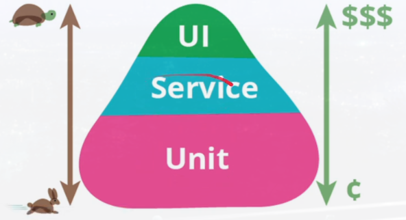
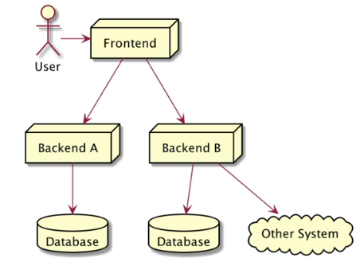
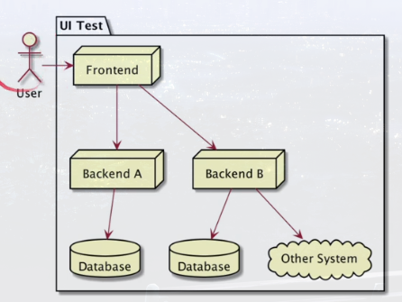
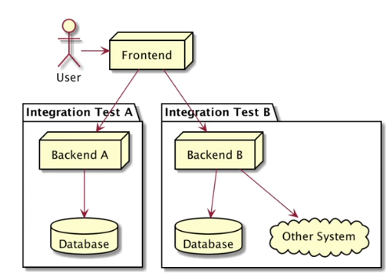
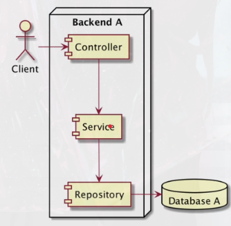
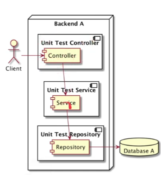

# Unit Test

## Sebelum Belajar

- Go-Lang Dasar
- Go-Lang Modules

## Agenda

- Pengenalan Software Testing.
- testing Package.
- Unit Test.
- Assertion.
- Mock.
- Benchmark.

## Pengenalan Software Testing

- Software testing adalah salah atu disiplin ilmu dalam Software engineering.
- Tujuan utama dari software testing adalah memastikan kualitas kode dan aplikasi kita baik.
- Ilmu untuk software testing sangatlah luas, pada materi ini kita hanya akan fokus ke unit testing.

### Test Pyramid



### Contoh High Level Architecture Aplikasi



### UI Test / End to End Test



### Service Test / Integration Test



### Contoh Internal Architecture Aplikasi



### Unit Test diagram



### Pengertian Unit Test

- Unit test akan fokus menguji bagian kode program terkecil, biasanya menguji sebuah method.
- Unit test biasanya dibuat kecil dan cepat, oleh karena itu biasanya kadang kode unit test lebih banyak dari kode program aslinya, karena semua skenario pengujian akan dicoba di unit test.
- Unit test bisa digunakan sebagai cara untuk mengigkatkan kualitas

## Pengenalan Testing Package

- Di bahasa pemrograman lain, biasanya untuk implementasi unit test, kita butuh library atau framework khusus untuk unit test.
- Berbeda dengan Go-Lang, di Go-Lang sudah untuk unit test sudah disediakan sebuah package khusus bernama `testing`.
- Selain itu untuk menjalankan unit test, di Go-Lang juga sudah disediakan perintahnya.
- Hal ini membuat implementasi unit testing di golang sangat mudah dibanding dengan bahasa pemrograman yang lain.
- [testing](https://golang.org/pkg/testing)

### `testing.T`

- Go-Lang menyediakan sebuah struct bernama `testing.T`.
- Struct ini digunakan untuk unit test di Go-Lang.

### `testing.M`

- `testing.M` adalah struct yang disediakan Go-Lang mengatur life cycle testing.
- Materi ini nanti akan kita bahas di cahpter main.

### `testing.B`

- `testing.B` adalah struct yang disediakan Go-Lang untuk melakukan benchmarking.
- Di Go-Lang untuk melakukan benchmark (mengukur kecepatan kode program) pun sudah disediakan, sehingga kita tidak perlu menggunakan library atau framework tambahan.

## Membuat unit test

### Kode : Hello World Function

```go
package helper

func HelloWorld(name string) string {
  return "Hello " + name
}
```

### Aturan File Test

- Go-Lang memiliki aturan cara membuat file khusus untuk unit test.
- Untuk membuat file unit test, kita harus menggunakan akhiran `_test`.
- Jadi kita misal kita membuat file `hello_world.go`, artinya untuk membuat unit testnya, kita harus memubat file `hello_world_test.go`.

### Aturan Function Unit Test

- Selain aturan nama file, di Go-Lang juga sudah diatur untuk nama function unit test.
- Nama function untuk unit test harus diawali dengan nama Test.
- Misal jika ingin mengetest function HelloWorld, maka kita akan membuat function unit test dengan nama `TestHelloWorld`.
- Tidak ada aturan untuk nama belakang function unit test harus sama dengan nama function yang akan di test, yang penting adalah harus diawali dengan kata `Test`.
- Selanjutnya harus memiliki parameter `t *testing.T` dan tidak mengembalikan return value.

### Kode : Hello World Unit Test

```go
package helper

import (
	"fmt"
	"testing"
)

func TestHelloWorld(t *testing.T) {
  result := HelloWorld("Yusril")

  if result != "Hello Yusril" {
    // unit test failed
    panic("Result is not Hello Yusril")
  }

  fmt.Println(result)
}
```

### Menjalankan Unit Test

- Untuk menjalankan unit test kita bisa menggunakan perintah :
  - `go test`
- Jika kita ingin lihat detail function test apa saja yang sudah di running, kita bisa gunakan perintah :
  - `go test -v`.
- Dan jika kita ingin memilih function unit test mana yang ingin dirunnung, kita bisa gunakan perintah :
  - `go test -v -run TestNamaFunction`

### Menjalankan Semua Unit Test

- Jika kita ingin menjalankan semua unit test dari top folder modulenya, kita bisa gunakan perintah :
  - `go test ./..`

## Menggagalkan Unit Test

- Menggagalkan unit test menggunakan `panic` bukanlah hal yang bagus.
- Go-Lang sendiri sudah menyediakan cara untuk menggagalkan unit test menggunakan `testing.T`.
- Terdapat function `fail()`, `FailNow()`, `Error()` dan `Fata()` jika kita ingin menggagalkan unit test.

### `t.Fail()` dan `t.FailNow()`

- Terdapat dua function untuk menggagalkan unit test, yaitu `Fail()` dan `FailNow()`. LAntas apa bedanya ?
- `Fail()` akan menggagalkan unit test, namun tetap melanjutakan eksekusi unit test. Namun diakhir ketika selesai, maka unit test tersebut dianggap gagal.
- `FailNow()` akan menggaalkan unit test saat ini juga, tanpa melanjutkan eksekusi unit test.

---

```go
func TestHelloWorldYusril(t *testing.T) {
	result := HelloWorld("Yusril")

	if result != "Hello Yusril" {
		// unit test failed
		t.Fail()
	}

	fmt.Println("TestHelloWorldYusril done")
}
```

---

```go
func TestHelloWorldArzaqi(t *testing.T) {
	result := HelloWorld("Arzaqi")

	if result != "Hello Arzaqi" {
		// unit test failed
		t.FailNow()
	}

	fmt.Println("TestHelloWorldArzaqi done")
}
```

### `t.Error(args...)` dan `t.Fatal(args...)`

- Selain `Fail()` dan `FailNow()`, ada juga `Error()` dan `Fatal()`.
- `Error()` function lebih seperti melakukan log `print` error, namun setelah melakukan log error, dia akan secara otomatis memanggil function `Fail()`, sehingga mengakibatkan unit test dianggap gagal.
- Namun karena hanya memanggil `Fail()`, artinya eksekusi unit test akan tetap berjalan sampai selesai.
- `Fatal()` mirip dengan `Error()`, hanya saja, setelah melakukan log error, dia akan memanggil `FailNow()`, sehingga mengakibatkan eksekusi unit test berhenti.

---

```go
func TestHelloWorldBimo(t *testing.T)  {
  result := HelloWorld("Bimo")

  if result != "Hello Bimo" {
    t.Error("Harusnya Hello Bimo")
  }

  fmt.Println("Dieksekusi")
}
```

---

```go
func TestHelloWorldAlamsyah(t *testing.T) {
  result := HelloWorld("Alamsyah")

  if result != "Hello Alamsyah" {
    t.Fatal("Harusnya Hello Alamsyah")
  }

  fmt.Println("Tidak Dieksekusi")
}
```

## Assertion

- Melakukan pengecekan di unit test secara menual menggunakan `if`, `else` sangatlah menyebalkan.
- Apalagi jika result yang harus di cek itu banyak.
- Oleh karena itu, sangat disarankan untuk menggunakan Assertion untuk melakukan pengecekan.
- Sayangnya, Go-Lang tidak menyediakan package untuk assertion, sehingga kita butuh menambahkan library untuk melakukan assertion ini.

### Testify

- Salah satu library assertion yang paling populer di Go-Lang adalah Testify.
- Kita bisa menggunakan library ini untuk melakukan assertion terhadap result data di unit test.
- [testify](https://github.com/stretchr/testify)
- Kita bisa menambahkan di Go module kita :
  - `go get github.com/stretchr/testify`

### `assert` vs `require`

- Testify menyediakan dua package assertion, yaitu assert dan require.
- Saat kita menggunakan assert akan memanggil `Fail()`, artinya eksekusi unit test akan tetap dilanjutkan.
- Sedangkan jika kita menggunakan `require`, jika pengecekan gagal, maka require akan memanggil `FailNow()`, artinya eksekusi unit test tidak akan dilanjutkan.

---

```go
package helper

import (
	"fmt"
	"testing"
	"github.com/stretchr/testify/assert"
)

func TestHelloWorldAssertion(t *testing.T) {
	result := HelloWorld("Yusril")
	assert.Equal(t, "Hello Yusril", result, "Result must be Hello Yusril")
	fmt.Println("Dieksekusi")
}
```

---

```go
package helper

import (
	"fmt"
	"testing"
	"github.com/stretchr/testify/require"
)

func TestHelloWorldRequire(t *testing.T) {
  result := HelloWorld("Yusril")
  require.Equal(t, "Hell Yusril", result)
  fmt.Println("tidak dieksekusi")
}
```

##
